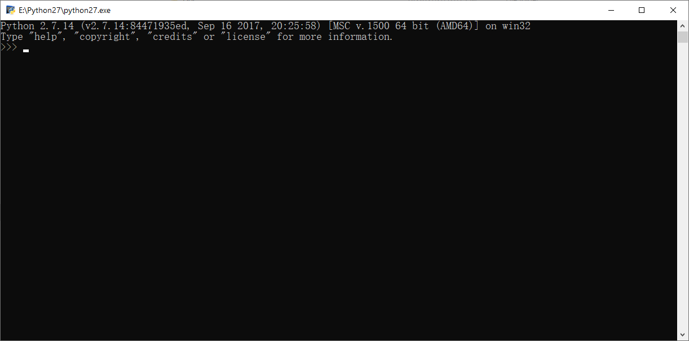
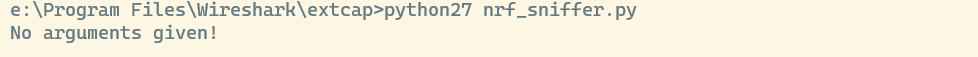

# ble sniffer 使用方法 


## 1.按照青风老师文档说明，做下列事情 

1. 安装python2.7，加入到PATH  
2. 下载nrf_sniffer压缩包，解压到wireshark指定目录 
3. 如果不能成功，做下面的事情 


## 2. 检测python 2.7 有没有安装成功 


1. 打开python 安装目录，双击python.exe， 看是否正常输出 



2. 在命令行上运行python

`python --version`
看是否有正常输出，若没有，可能`PATH`配置错误，继续核对路径。 还有一种可能电脑上的`python` 安装了两个版本。两个python可执行文件，可能有冲突。建议可将`python2.7`安装目录下的`python.exe`,修改为`python27.exe`,在命令行上输入`python27 --version`

## 3.检测是否能正常运行`nrf_sniffer` 脚本

打开wireshark extcap目录下，目前应该有nrf_sniffer.bat 文件和 nrf_sniffer.py 文件，等其他文件. 打开`nrf_sniffer.bat`文件,这个文件也是wireshrak会直接使用的脚本文件。用来操作`ble snifer`

```bat  
@echo off
rem Path to this batch file
set NRF_SNIFFER_PATH=%~dp0
rem Remove the "\" from the end of the path
set NRF_SNIFFER_PATH=%NRF_SNIFFER_PATH:~0,-1%
rem Activate virtualenv if present
if exist "%NRF_SNIFFER_PATH%\env\Scripts\activate.bat" call "%NRF_SNIFFER_PATH%\env\Scripts\activate.bat"
"python" "%NRF_SNIFFER_PATH%\nrf_sniffer.py" %*
```


看到最后一行. 大致就是运行`nrf_sniffer`脚本的命令。 如在前边修改了`python.exe` 改为`python27.exe`,可在此处，修改`python`为`python27` 。

我们可以在命令行上键入如下命令 

```bash 
cd [wireshark安装目录]
cd extcap 
python nrf_sniffer.py 
```
看是否有正常输出,应该差不多像下面这样



如果此时提示找不到`serial` 包。

运行 

```
python -m pip install pyserial 
```


